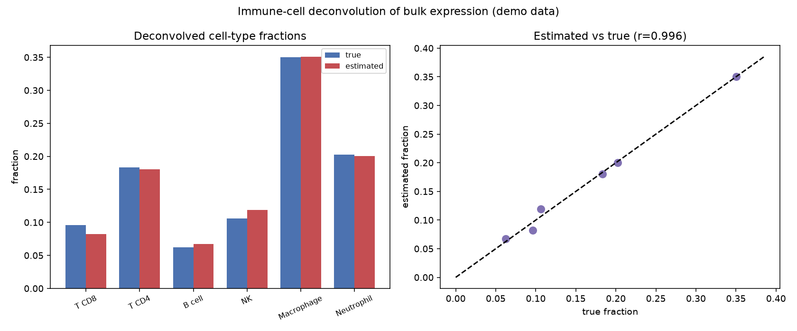

# Immune Cell Deconvolution

A bulk RNA-seq sample from a tumour is a blend of cancer cells, T cells, macrophages, and more — all averaged together. Deconvolution un-mixes that average, estimating what fraction of the sample each cell type contributed. In immuno-oncology, those fractions are the whole game.

## Why This Matters

Whether a tumour responds to immunotherapy depends heavily on which immune cells have infiltrated it — "hot" tumours full of CD8 T cells behave very differently from "cold" ones. But bulk expression hides this in an average. Deconvolution (the idea behind CIBERSORT and friends) uses a reference signature matrix of cell-type-specific gene expression and solves for the mixing proportions that best reconstruct the observed bulk profile. It recovers the immune composition without ever sorting a single cell.

## How It Works

1. Start from a signature matrix: marker-gene expression for each cell type.
2. Model the bulk sample as a non-negative mixture of those signatures.
3. Solve the non-negative least-squares problem for the cell-type fractions.

## What the Demo Shows



The demo mixes six immune cell types in known proportions, adds noise, then recovers the fractions by deconvolution. Estimated fractions track the true ones closely — the same procedure you would run to score immune infiltration in a real tumour cohort.

## Run It

```bash
pip install -r requirements.txt
python demo.py
```

> Demonstrated on synthetic data, so it's fully reproducible with no external downloads.
